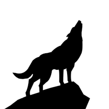

# Werewolf Moderator

This game is intended to work as a stand in for the player role of moderator so
that all people in attendance can play the game itself. This is done by using discord
as a medium for transmitting both public and private game information regarding the
events in the game. 

## Requirements

To run this game module, some form of database is needed. MySQL was used by the
developer when initially creating this. Other database options were not tested for 
so there is no guarantee that they will work. An account for your database is also required.
The module requires the "root" account with the password stored in a textfile labeled 
"dbPassLoc.txt"

### Setting up requirements

-TODO
